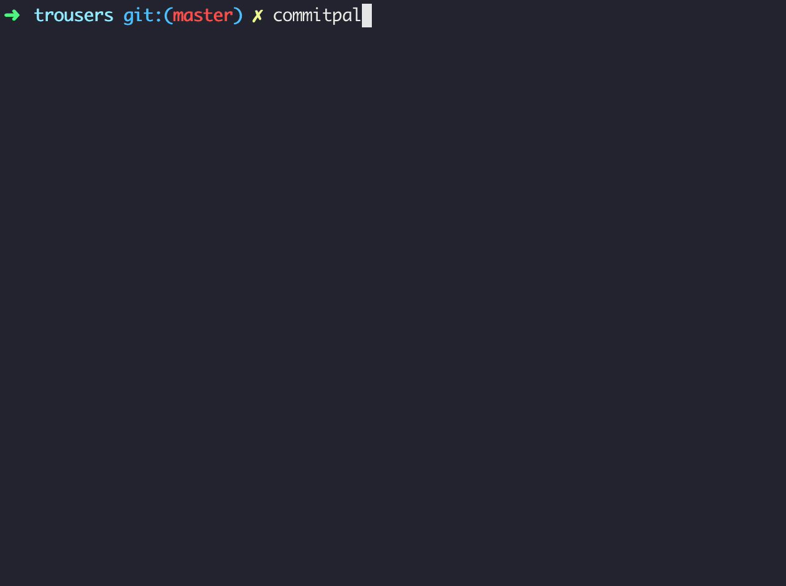

<p align="center">
  
</p>

# CommitPal

A delightful CLI tool for building commit messages which conform to your project's specific commit message format.

<p align="center">
  
</p>

## Install ⬇️

Install globally

```bash
npm install -g commitpal
```

## Get started 🏁

```bash
commitpal
```

Usage with npx

```bash
npx commitpal
```

## API 🤖

- `--config`, `-c` Custom configuration file
- `--preset`, `-p` Select an inbuilt preset. Options: 'angular', 'emoji', 'jira'
- `--nowelcome`, `-n` Omit welcome message
- `--help` `Help`me
- `--version`, `-v` Version number

## Examples

- `$ commitpal --config ../commitpal.config.json`
- `$ commitpal --nowelcome`
- `$ commitpal --preset emoji`
- `$ npx commitpal`

## Presets

CommitPal is loaded with the following collection of preset configurations:

- **Emoji**: The Emoji commit format loosely [based on this Gist](https://gist.github.com/parmentf/035de27d6ed1dce0b36a)
- **Angular**: [The Angular commit message conventions](https://gist.github.com/stephenparish/9941e89d80e2bc58a153)
- **Jira**: An unofficial format that simply accepts a Jira ticket id and a message

Don't like these presets, or want to provide your own? Raise a Pull Request 🙏

## Configuration

If you're not using one of the predefined commit message formats, CommitPal will attempt to search for a `commitpal.config.json`.

Which can be configured like so:

```json
{
  "name": "Angular commit message format",
  "steps": [
    {
      "type": "option",
      "message": "What type of change?",
      "options": [
        { "value": "feat", "description": "feature" },
        { "value": "fix", "description": "bug fix" },
        { "value": "docs", "description": "documentation" },
        {
          "value": "style",
          "description": "formatting, missing semi colons, …"
        },
        { "value": "test", "description": "tests" },
        { "value": "chore", "description": "adhoc maintenance" }
      ]
    },
    {
      "type": "option",
      "message": "What scope of the project is affected?",
      "before": "(",
      "after": "):",
      "options": [
        { "value": "authentication", "description": "Authentication modules" },
        { "value": "users", "description": "User profiles" },
        { "value": "settings", "description": "Settings" },
        { "value": "payments", "description": "Payments modules" },
        { "value": "shipping", "description": "Shipping modules" },
        { "value": "build system", "description": "Build system" },
        { "value": "CI", "description": "Continuous integration" }
      ]
    },
    {
      "type": "text",
      "message": "Summarise this change..."
    },
    {
      "type": "text",
      "before": "\n\n",
      "message": "Describe this change..."
    },
    {
      "type": "text",
      "before": "\n\n",
      "message": "Describe any breaking changes..."
    }
  ]
}
```

## You might also like...

- [ScriptPal](https://github.com/zeropoly/scriptpal): A simple npm script palette for lazy people
- [Enquirer](https://github.com/enquirer/enquirer): Stylish, intuitive and user-friendly prompts
